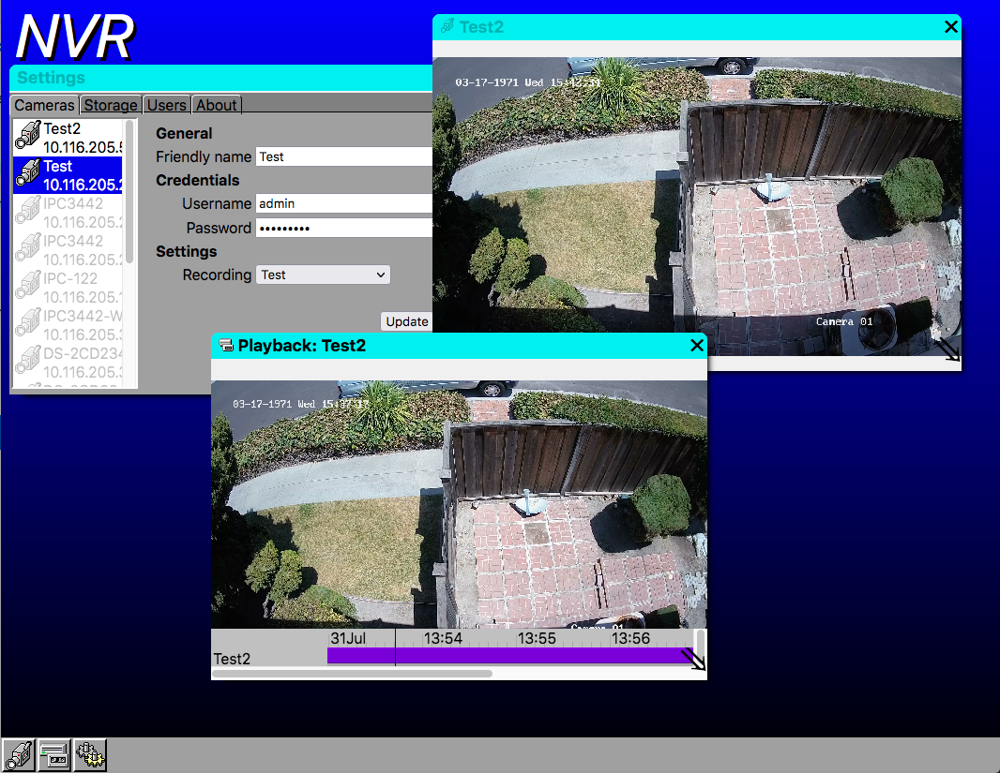

# MiniNVR

A small NVR application for ONVIF cameras

## Purpose

Sad at the state of Open Source CCTV applications, none of which really meet the baseline of even the cheapest dedicated NVR (which are usually even based on Linux, but with a proprietary app), I decided I needed to create something that could achieve a similar level of usability.

I chose C# for managed safety, to protect from buffer overruns, underruns, general parse errors and crashes. On the downside there is a performance impact, but on the upside there are a number of libraries available to drop in and gain major bits of functionality, like RTSP streaming and MP4 container support.

## Features

- No dependency on ffmpeg or other RTSP/h264 tools - it directly parses the RTSP stream and generates HTTP streams natively.
- Web browser streaming - it can generate MP4 fragmented files on the fly.
- Web interface - no client apps for maximum OS compatibility.
- Retro '90s style - I've come to prefer this over the unpleasant flat nothingness currently popular in modern UI design.

## TODOs

In order:
- Recording (this is currently WIP, some code is written but it's untested, and there's no UI to try it)
- Events (these will be saved in tags on the recording, and appear on the timeline as highlights)
- PTZ (should be simple)
- Security (currently there's no login screen, should also be simple)

## Screenshot

## Building

A Dockerfile is provided that has been tested under Debian, and should successfully build all dependencies and the server itself. You can launch it with a command like:

docker run -p 8080:12345 mininvr

This will cause it to start listening on port 8080 of the host machine. Note that the default Docker network settings will prevent onvif discovery from working, so you'll need to tweak settings (host networking will work, but other options may be better if you have a more complex IP camera network set up).

These are the dependencies, which are included as git submodules:
- https://github.com/electric-monk/bmff.git (my fork of https://github.com/heksesang/bmff.git, fixes some issues with saving MP4s)
- https://github.com/vmartos/onvif-discovery
- https://github.com/BogdanovKirill/RtspClientSharp
